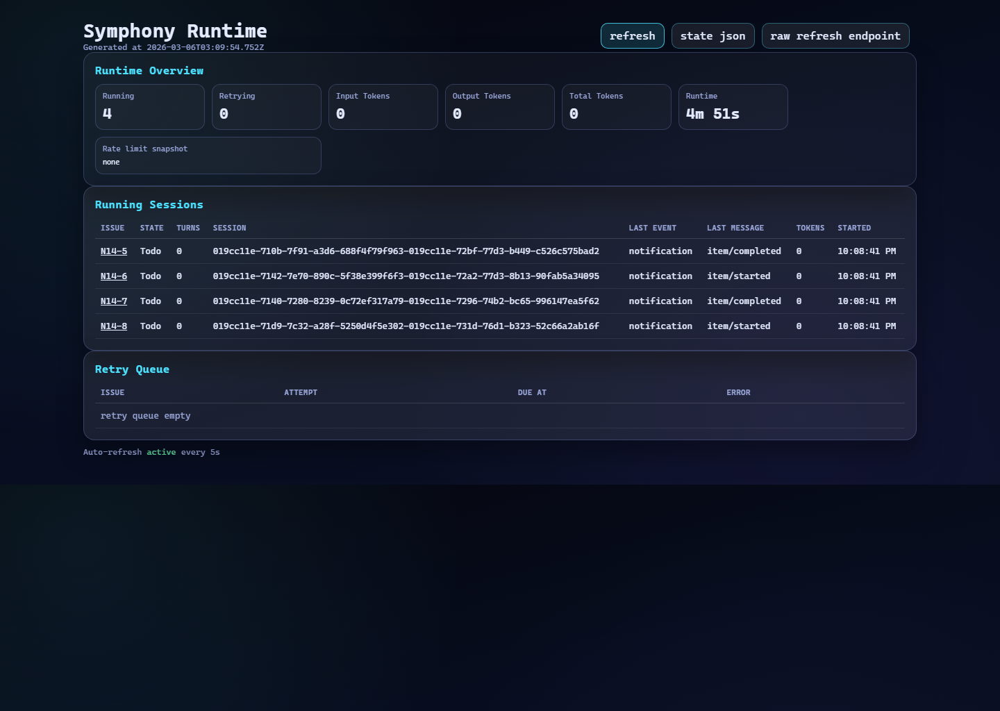
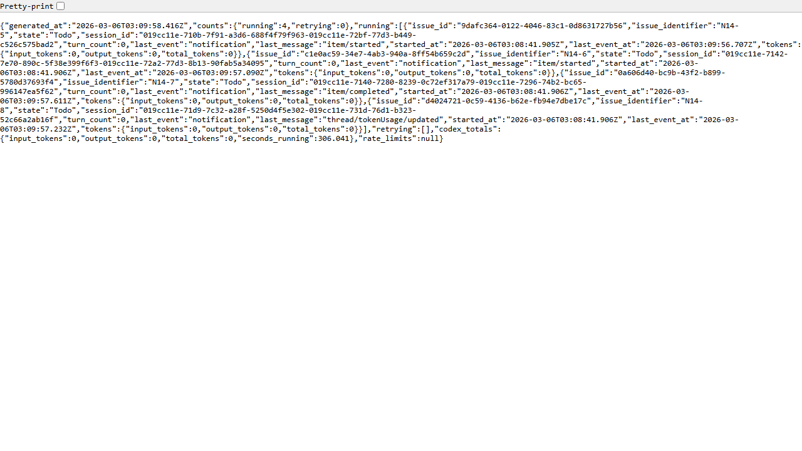

# Symphony Walkthrough

Symphony is easier to judge as a fork once you look at the evidence first. The screenshots below show the two surfaces this repo cares about most: the operator dashboard and the JSON state it exposes under the hood.

## Screenshot Walkthrough

The dashboard gives active runs a readable surface instead of hiding them behind logs and guesses.

The API view shows the same idea in a different form: state is inspectable, not buried.

## What To Review

1. Read [README.md](../README.md) for the short version of the fork.
2. Read [fork-notes.md](fork-notes.md) if you want the authorship and change framing.
3. Inspect the dashboard and API code paths to see how the repo exposes run state.

## Notes

This is not presented as a greenfield invention. The value is in the implementation work visible here: verification gates, observability, and safer completion behavior.
