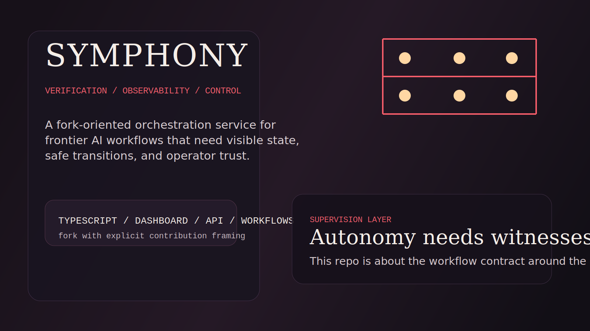

# Symphony Landing

## What This Is

Symphony is a fork-oriented workflow service focused on verification gating, observability, and operator control for autonomous execution.

## Who It Is For

This repo is for reviewers evaluating how frontier-AI orchestration ideas become operational software with visible state, explicit workflow contracts, and safer external-system write-back.

## Why This Exists

The point of this repo is contribution framing through execution quality. It shows what changed in the fork and why those changes matter: trust, visibility, and control are treated as product requirements instead of afterthoughts.

## Screenshot Walkthrough

The dashboard visualizes run state and gives the orchestration surface an operator-facing interface.

The API snapshot demonstrates that internal state is inspectable, not hidden behind opaque execution.

## Quick Evaluation

1. Read the top-level [README.md](../README.md).
2. Review [fork-notes.md](fork-notes.md) for authorship and delta framing.
3. Inspect the dashboard and API code paths for how observability is exposed.

## Repo Signals

- explicit fork attribution
- visible API and dashboard evidence
- verification-focused positioning
- strong fit with frontier-AI investigation and defense-adjacent operator tooling
